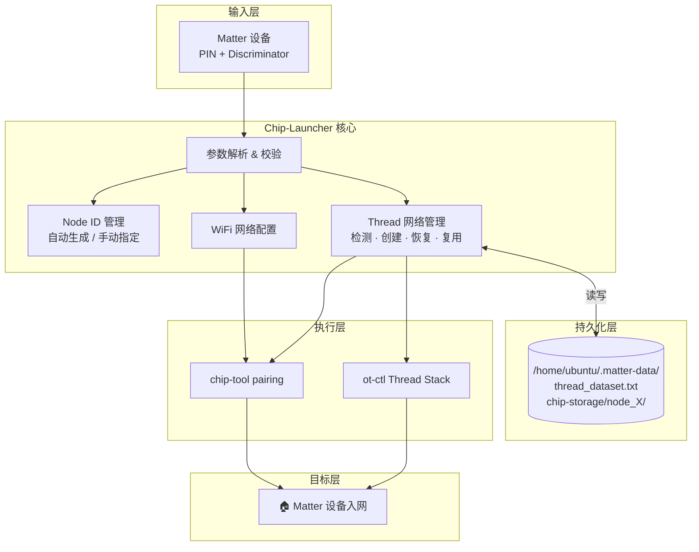
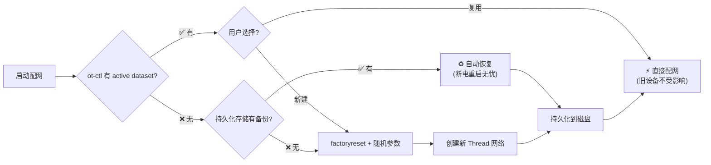
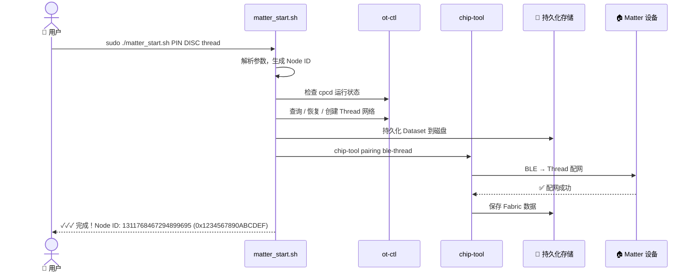

<p align="center">
  
  
  
  
  
</p>

<h1 align="center">🚀 Chip-Launcher for Matter</h1>

<p align="center">
  <strong>一 键 配 网 · 优 雅 管 理 · 永 不 丢 失</strong><br>
  为 Matter 物联网设备打造的生产级一键配网工具
</p>

<p align="center">
  📖 <a href="README.md">中文文档</a> &nbsp;|&nbsp;
  🌐 <a href="README_EN.md">English</a>
</p>

---

## 📖 概述

**Chip-Launcher-ForMatter** 是一个面向 Matter 生态的生产级 Shell 配网工具，将 `chip-tool` 的复杂命令行操作封装为简洁的一键脚本。无论你是开发者调试设备、产线批量配网，还是智能家居爱好者 DIY，它都能让你省去繁琐的手动步骤，专注于业务本身。

### ✨ 为什么选择 Chip-Launcher？

| 特性 | Chip-Launcher | 原生 chip-tool |
|---|---|---|
| 一键配网 | ✅ `./matter_start.sh` | ❌ 多步手动操作 |
| 自动 Node ID | ✅ 随机生成，自动去重 | ❌ 手动指定 |
| Thread 网络管理 | ✅ 自动检测 / 创建 / 恢复 | ❌ 需 ot-ctl 手动操作 |
| 断电数据保护 | ✅ 自动持久化 | ❌ 重启即丢失 |
| 批量脚本支持 | ✅ `-y` 自动确认 | ❌ 需处理交互提示 |
| 多设备隔离 | ✅ 按节点独立存储 | ❌ 手动管理目录 |

---

## 🏗️ 架构



---

## 🚀 快速开始

### 环境要求

| 组件 | 要求 |
|---|---|
| **操作系统** | Ubuntu 22.04+ / Raspberry Pi OS (Bookworm) |
| **Matter SDK** | chip-tool（已编译） |
| **OTBR** | OpenThread Border Router（Thread 模式下必需） |
| **cpcd** | Co-Processor Communication Daemon |
| **工具链** | `openssl`, `python3` |

### 基本用法

```bash
sudo ./matter_start.sh <pin_code> <discriminator> [nodeid] <protocol> [options]
```

### 30 秒上手

```bash
# Thread 配网（Node ID 自动生成，推荐）
sudo ./matter_start.sh 12345678 3840 thread

# WiFi 配网
sudo ./matter_start.sh 12345678 3840 wifi --ssid MyHomeWiFi --password MyPassword

# 脚本自动化模式 — 自动确认所有交互
sudo ./matter_start.sh 12345678 3840 thread -y
```

---

## 📋 参数详表

### 必填参数

| 参数 | 类型 | 说明 |
|---|---|---|
| `pin_code` | `uint32` | Matter 设备 PIN 码，印于设备机身或由固件生成 |
| `discriminator` | `uint16` | 蓝牙发现鉴别码，范围 0–4095 |
| `protocol` | `enum` | 入网协议：`wifi` 或 `thread` |

### 可选参数

| 参数 | 默认值 | 说明 |
|---|---|---|
| `nodeid` | 自动生成 | 节点 ID（范围 1 ~ 0xFFFF_FFEF_FFFF_FFFF），自动去重；不填则随机生成并同时打印十进制与十六进制 |

### WiFi 专用

| 参数 | 说明 |
|---|---|
| `--ssid <ssid>` | WiFi 网络名称（必填） |
| `--password <pwd>` | WiFi 密码（必填） |

### Thread 专用

| 参数 | 说明 |
|---|---|
| `--force-create-threadnetwork` | 强制新建 Thread 网络，忽略已有网络 |
| `--use-thread-network <dataset>` | 使用指定的 Thread Dataset（十六进制字符串） |
| `--thread-set-channel <ch>` | 指定 Thread 信道（11–26），不填则随机生成 |

### 通用选项

| 参数 | 说明 |
|---|---|
| `-y`, `--yes` | 自动确认交互提示，检测到已有 Thread 网络时跳过手动输入自动选 `y` |
| `--help`, `-h` | 显示帮助信息 |
| `--clear-cache` | ⛔ **已废弃**，请使用 `--force-create-threadnetwork` 替代 |

---

## 🧵 Thread 网络管理

Chip-Launcher 内置了完整的 Thread 网络生命周期管理，这也是它与原生 `chip-tool` 最大的不同——无需手动操作 `ot-ctl`，脚本自动处理一切。



### Thread 配网场景示例

```bash
# 场景 1：首次使用 — 自动创建新网络
sudo ./matter_start.sh 12345678 3840 thread

# 场景 2：设备断电重启 — 自动从磁盘恢复网络
sudo ./matter_start.sh 87654321 3841 thread

# 场景 3：批量配网 — 跳过交互
sudo ./matter_start.sh 12345678 3840 thread -y

# 场景 4：更换网络拓扑 — 强制重建 + 指定信道
sudo ./matter_start.sh 12345678 3840 thread --force-create-threadnetwork --thread-set-channel 25

# 场景 5：加入已有网络 — 指定 Dataset
sudo ./matter_start.sh 12345678 3840 thread --use-thread-network "0e080000000000010000..."
```

---

## 💾 数据持久化

所有配网产生的关键数据均保存在 **`/home/ubuntu/.matter-data/`**，断电重启后不会丢失：

```
/home/ubuntu/.matter-data/
├── thread_dataset.txt          # 当前 Thread 网络 Dataset（十六进制）
├── thread_network_name.txt     # 当前 Thread 网络名称
└── chip-storage/
    ├── node_1/                 # 节点 1 的 Fabric 数据
    ├── node_2/                 # 节点 2 的 Fabric 数据
    └── node_3/                 # 节点 3 的 Fabric 数据
```

| 关键行为 | 说明 |
|---|---|
| **断电重启** | 若 ot-ctl 没有 active dataset（OTBR 重启后 RAM 数据丢失），脚本自动从 `thread_dataset.txt` 恢复 Thread 网络 |
| **多设备隔离** | 每个设备配网后数据存放在独立的 `node_<id>` 子目录中，多设备数据互不干扰 |
| **Fabric 保留** | chip-tool 从 `chip-storage/` 读取 Fabric 数据，已配对的旧节点依然可以控制 |

---

## 🎯 完整工作流



---

## ⚙️ Thread 新网络创建流程

当脚本需要创建新 Thread 网络时，自动执行以下步骤：

1. 停止当前 Thread 栈并执行 `factoryreset`，确保干净状态
2. 随机生成网络参数：Extended PAN ID、Network Name、PAN ID、Network Key、Channel
3. 逐条配置 `ot-ctl dataset` 并 `commit active`
4. 执行 `ifconfig up` + `thread start` 启动网络
5. 将 Dataset 持久化保存到 `/home/ubuntu/.matter-data/thread_dataset.txt`

---

## 📝 注意事项

### ⚠️ 必须使用 sudo 执行

脚本需要访问 OTBR socket、系统服务（cpcd、otbr-agent、avahi-daemon）以及持久化目录 `/home/ubuntu/.matter-data/`，**必须使用 `sudo` 运行**，否则会因权限不足而失败。

### ⚠️ 手动指定 Node ID 不能重复

如果手动指定 `nodeid`，脚本会检查 `chip-storage/node_<id>` 目录是否已存在。**若该节点已配过网则报错退出**，提示你更换 Node ID 或先使用 `--force-create-threadnetwork` 重置网络：

```
✗ Error: Node ID 1 already exists (chip-storage/node_1)
  This node appears to have been commissioned already.
  Use a different Node ID or use --force-create-threadnetwork first.
```

因此建议**不填 nodeid** 让脚本自动生成，避免冲突。

### ⚠️ Node ID 输出格式

脚本执行完成后会同时打印 Node ID 的十进制和十六进制格式，例如：

```
Node ID       :  1311768467294899695 (0x1234567890ABCDEF)
```

### ⚠️ 强制新建网络会断开旧设备

`--force-create-threadnetwork` 会丢弃现有网络并生成全新参数（Extended PAN ID、Network Key 等），**之前已入网的旧设备将全部断开连接**。仅在你需要彻底重建网络拓扑时使用。

### ⚠️ `--clear-cache` 已废弃

该参数仍保留向下兼容，但其操作不安全（会清除所有缓存及持久化数据）。新流程请统一使用 `--force-create-threadnetwork` 替代。

### ⚠️ Thread 配网自动检测提示

当检测到已有 Thread 网络时，脚本会提示：

```
✓ Found existing Thread network
  Dataset: 0e0800000000000100004a03...
  Use existing network? (y/n):
```

- 输入 `y`：直接使用现有网络配网，**已入网的旧设备连接不受影响**
- 输入 `n`：丢弃现有网络，自动创建新网络后再配网

如果需要脚本自动化调用，加上 `-y` / `--yes` 参数即可自动选择 `y` 复用网络。

### ⚠️ 互斥参数

`--force-create-threadnetwork` 与 `--use-thread-network` 不可同时使用，脚本会报错退出。

---

## 📦 项目结构

```
Chip-Launcher-ForMatter/
├── matter_start.sh              # 核心脚本
├── README.md                    # 中文文档（本文件）
├── README_EN.md                 # English documentation
└── LICENSE                      # MIT License
```

---

## 🤝 贡献

欢迎提交 Issue 和 Pull Request！

---

## 📄 许可

本项目基于 [MIT License](LICENSE) 开源。

---

<p align="center">
  <sub>为 Matter 生态倾心构建 · <a href="https://csa-iot.org/all-solutions/matter/">CSA Matter 1.4</a> · <a href="https://www.threadgroup.org/">Thread 1.4</a></sub>
</p>
