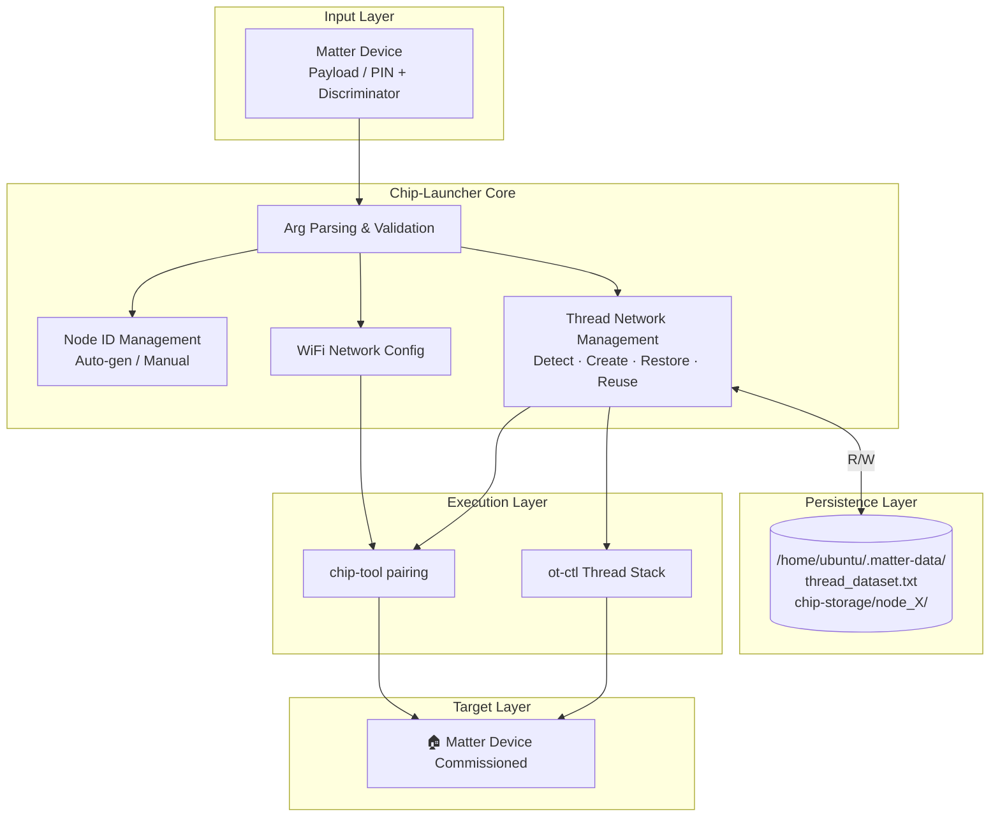
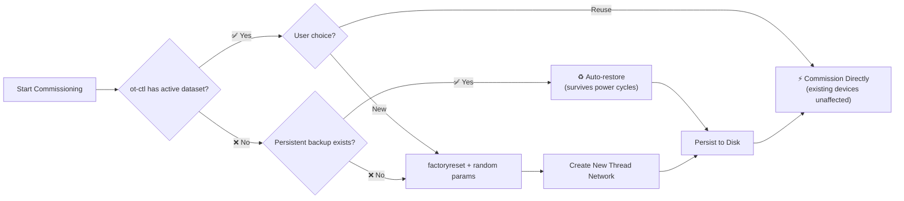
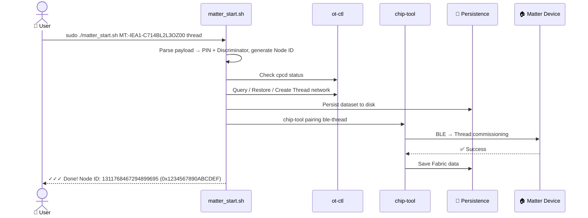

<p align="center">
  
  
  
  
  
</p>

<h1 align="center">🚀 Chip-Launcher for Matter</h1>

<p align="center">
  <strong>One-Click Commissioning · Elegant Management · Zero Data Loss</strong><br>
  A production-grade one-click commissioning tool for the Matter IoT ecosystem
</p>

<p align="center">
  📖 <a href="README.md">中文文档</a> &nbsp;|&nbsp;
  🌐 <a href="README_EN.md">English</a>
</p>

---

## 📖 Overview

**Chip-Launcher-ForMatter** is a production-grade shell commissioning tool for the Matter ecosystem. It wraps the complex CLI operations of `chip-tool` into a simple one-click script. Whether you're a developer debugging devices, a factory provisioning in batch, or a smart-home enthusiast, Chip-Launcher eliminates tedious manual steps so you can focus on what matters.

### ✨ Why Chip-Launcher?

| Feature | Chip-Launcher | Raw chip-tool |
|---|---|---|
| One-click commissioning | ✅ `./matter_start.sh` | ❌ Multi-step manual ops |
| Auto Node ID | ✅ Random gen, auto dedup | ❌ Manual assignment |
| Thread network mgmt | ✅ Auto detect / create / restore | ❌ Manual ot-ctl ops |
| Power-cycle safety | ✅ Auto persistence | ❌ Lost on reboot |
| Batch scripting | ✅ `-y` auto-confirm | ❌ Interactive prompts |
| Multi-device isolation | ✅ Per-node storage | ❌ Manual dir management |

---

## 🏗️ Architecture



---

## 🚀 Quick Start

### Requirements

| Component | Requirement |
|---|---|
| **OS** | Ubuntu 22.04+ / Raspberry Pi OS (Bookworm) |
| **Matter SDK** | chip-tool (compiled) |
| **OTBR** | OpenThread Border Router (required for Thread mode) |
| **cpcd** | Co-Processor Communication Daemon |
| **Toolchain** | `openssl`, `python3` |

### Basic Usage

```bash
sudo ./matter_start.sh <pin_code> <discriminator> [nodeid] <protocol> [options]
```

### Get Started in 30 Seconds

```bash
# Payload mode (recommended) — pass the setup payload, auto-parse PIN & Discriminator
sudo ./matter_start.sh <payload> [nodeid] <protocol> [options]

# Legacy mode — specify PIN and Discriminator manually
sudo ./matter_start.sh <pin_code> <discriminator> [nodeid] <protocol> [options]

# Payload mode — pass the setup payload directly, auto-parse (recommended)
sudo ./matter_start.sh MT:-IEA1-C714BL2L3OZ00 thread

# Thread commissioning (manual PIN + Discriminator, auto-generated Node ID)
sudo ./matter_start.sh 12345678 3840 thread

# WiFi commissioning (Payload mode)
sudo ./matter_start.sh MT:-IEA1-C714BL2L3OZ00 wifi --ssid MyHomeWiFi --password MyPassword

# WiFi commissioning (Legacy mode)
sudo ./matter_start.sh 12345678 3840 wifi --ssid MyHomeWiFi --password MyPassword

# Batch mode — auto-confirm all prompts
sudo ./matter_start.sh 12345678 3840 thread -y
```

---

## 📋 Parameter Reference

### Required Arguments

| Argument | Type | Description |
|---|---|---|
| `payload` | `string` | **(Recommended)** Matter setup payload, e.g. `MT:-IEA1-C714BL2L3OZ00`. The script auto-calls `chip-tool payload parse-setup-payload` to extract PIN Code and Discriminator |
| `pin_code` | `uint32` | **(Legacy)** Matter device PIN code (printed on device or from firmware) |
| `discriminator` | `uint16` | **(Legacy)** BLE discovery discriminator, range 0–4095 |
| `protocol` | `enum` | Commissioning protocol: `wifi` or `thread` |

> 💡 **Payload mode recommended**: Simply pass the setup payload printed on the device. The script auto-parses PIN and Discriminator — no manual entry, no typos.

### Optional Arguments

| Argument | Default | Description |
|---|---|---|
| `nodeid` | Auto-generated | Node ID (range 1 ~ 0xFFFF_FFEF_FFFF_FFFF), auto-dedup. If omitted, a random value is generated and printed in both decimal and hex |

### WiFi Options

| Option | Description |
|---|---|
| `--ssid <ssid>` | WiFi SSID (required for WiFi) |
| `--password <pwd>` | WiFi password (required for WiFi) |

### Thread Options

| Option | Description |
|---|---|
| `--force-create-threadnetwork` | Force create new Thread network, ignore existing |
| `--use-thread-network <dataset>` | Use a specific Thread Dataset (hex string) |
| `--thread-set-channel <ch>` | Specify Thread channel (11–26), random if omitted |

### Common Options

| Option | Description |
|---|---|
| `-y`, `--yes` | Auto-confirm interactive prompts; auto-selects `y` when an existing Thread network is detected |
| `--help`, `-h` | Show help message |
| `--clear-cache` | ⛔ **Deprecated** — use `--force-create-threadnetwork` instead |

---

## 🧵 Thread Network Management

Chip-Launcher includes full Thread network lifecycle management — the biggest differentiator from raw `chip-tool`. No manual `ot-ctl` operations needed.



### Thread Commissioning Examples

```bash
# Case 1: First run (Payload) — auto-create network
sudo ./matter_start.sh MT:-IEA1-C714BL2L3OZ00 thread

# Case 2: First run (Legacy) — auto-create network
sudo ./matter_start.sh 12345678 3840 thread

# Case 3: Power-cycle recovery — auto-restore from disk
sudo ./matter_start.sh MT:-IEA1-C714BL2L3OZ00 thread

# Case 4: Batch provisioning — skip prompts
sudo ./matter_start.sh 12345678 3840 thread -y

# Case 5: New topology — force rebuild with specific channel
sudo ./matter_start.sh 12345678 3840 thread --force-create-threadnetwork --thread-set-channel 25

# Case 6: Join existing network — with hex dataset
sudo ./matter_start.sh 12345678 3840 thread --use-thread-network "0e080000000000010000..."
```

---

## 💾 Data Persistence

All critical commissioning data is persisted under **`/home/ubuntu/.matter-data/`** — survives power cycles and reboots:

```
/home/ubuntu/.matter-data/
├── thread_dataset.txt          # Current Thread network Dataset (hex)
├── thread_network_name.txt     # Current Thread network name
└── chip-storage/
    ├── node_1/                 # Node 1 Fabric data
    ├── node_2/                 # Node 2 Fabric data
    └── node_3/                 # Node 3 Fabric data
```

| Behavior | Description |
|---|---|
| **Power-cycle recovery** | If ot-ctl has no active dataset (OTBR RAM data lost after reboot), the script auto-restores from `thread_dataset.txt` |
| **Multi-device isolation** | Each commissioned device gets its own `node_<id>` subdirectory — zero interference |
| **Fabric retention** | chip-tool reads Fabric data from persistent storage; previously paired devices remain controllable |

---

## 🎯 End-to-End Flow



---

## ⚙️ New Thread Network Creation

When the script creates a new Thread network, it automatically:

1. Stops the current Thread stack and runs `factoryreset` to ensure a clean state
2. Randomly generates network parameters: Extended PAN ID, Network Name, PAN ID, Network Key, Channel
3. Configures `ot-ctl dataset` step-by-step and executes `commit active`
4. Runs `ifconfig up` + `thread start` to bring the network up
5. Persists the dataset to `/home/ubuntu/.matter-data/thread_dataset.txt`

---

## 📝 Important Notes

### ⚠️ Must Run with sudo

The script requires access to the OTBR socket, system services (cpcd, otbr-agent, avahi-daemon), and the persistence directory `/home/ubuntu/.matter-data/`. **Always use `sudo`** — the script will fail with insufficient permissions otherwise.

### ⚠️ Manual Node IDs Must Be Unique

When manually specifying a `nodeid`, the script checks whether `chip-storage/node_<id>` already exists. **If the node has been commissioned before, the script exits with an error**:

```
✗ Error: Node ID 1 already exists (chip-storage/node_1)
  This node appears to have been commissioned already.
  Use a different Node ID or use --force-create-threadnetwork first.
```

We recommend **omitting nodeid** and letting the script auto-generate one to avoid conflicts.

### ⚠️ Node ID Output Format

After execution, the script prints the Node ID in both decimal and hexadecimal:

```
Node ID       :  1311768467294899695 (0x1234567890ABCDEF)
```

### ⚠️ Force-Creating a Network Disconnects Old Devices

`--force-create-threadnetwork` discards the existing network and generates brand-new parameters (Extended PAN ID, Network Key, etc.). **All previously commissioned devices will be disconnected.** Use this only when you need to fully rebuild the network topology.

### ⚠️ `--clear-cache` is Deprecated

This option is retained for backward compatibility but is unsafe (it clears all caches and persistent data). Use `--force-create-threadnetwork` instead in all new workflows.

### ⚠️ Thread Auto-Detection Prompt

When an existing Thread network is detected, the script prompts:

```
✓ Found existing Thread network
  Dataset: 0e0800000000000100004a03...
  Use existing network? (y/n):
```

- Type `y`: Use the existing network directly — **previously commissioned devices remain unaffected**
- Type `n`: Discard the existing network and create a new one before commissioning

For automated scripting, add `-y` / `--yes` to auto-select `y` and reuse the network.

### ⚠️ Mutually Exclusive Options

`--force-create-threadnetwork` and `--use-thread-network` cannot be used together. The script will error and exit.

---

## 📦 Project Structure

```
Chip-Launcher-ForMatter/
├── matter_start.sh              # Core script
├── README.md                    # Chinese documentation
├── README_EN.md                 # English documentation (this file)
└── LICENSE                      # MIT License
```

---

## 🤝 Contributing

Issues and Pull Requests are welcome!

---

## 📄 License

This project is open-sourced under the [MIT License](LICENSE).

---

<p align="center">
  <sub>Built with ❤️ for the Matter Ecosystem · <a href="https://csa-iot.org/all-solutions/matter/">CSA Matter 1.4</a> · <a href="https://www.threadgroup.org/">Thread 1.4</a></sub>
</p>
